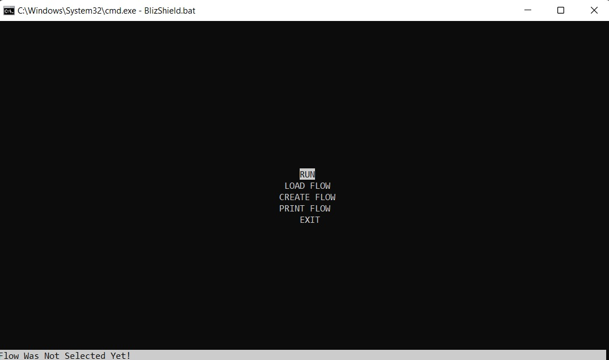

# BlizShield
BlizShield is a project that attempts to create a single place (dashboard) for analyzing network security.
The program provides 3 basic interfaces:
1. Plugins - an easy-to-use interface for adding new "plugins". Those plugins are independent from each other and from the global program. And so, users can add new plugins by themseleves relatively easy.
2. Exporters - we provide a set of possible "exporters" to use, for your choice. Basiclly, you can export it to any dashboard you want and show the data as you like. Currently, we support exporting to a *file* and exporting to *elastic*.
3. Flow - our program *does not* have a static flow that it runs by on every run. You choose, on each run how the program will run and what will it do. Blizshield follows a flow of instructions provided to her by a JSON file. You can create this one using the GUI and costumize the flow to your liking.

## How to run?
1. download the project. either by cloning it from this repo or downloading a release zip.
2. On windows, run - ```BlizShield.bat``` - this will open a TUI for blizshield.



3. Select ```LOAD FLOW```
4. Select the flow you want to run. _Note: explanation about creating a new flow is downwards_
5. Select ```YES```
6. And the flow you want is now loaded. Now, lets run it by selecting ```RUN```
7. That's it! you are running your flow!

## Create a new flow
1. Creating a new flow is easy, select ```CREATE FLOW``` from the main screen
2. Select ```ADD PLUGIN``` to add a new plugin to your flow
3. Choose the plugin you want to the to the flow and fill the configuration for that plugin. _NOTE: Plugin name should be unique_
4. Now you need to choose, if you want to run the plugin in PARALLEL with the other plugins or SEQUANTIAL to some plugin.
   1. PARALLEL - will run the plugin in a seperate thread alongside the other plugins
   2. SEQUANTIAL - will run the plugin after one of the other plugins in the flow. But you should choose the condition on which the plugin will run. the possible choices are:
      1. RUN ANYWAY - will run the plugin after the selected previous plugin anyway (no condition)
      2. RUN ONLY IF STATUS IS TRUE - will run the plugin only if one of the results in the previous plugin is TRUE
      3. RUN ONLY IF STATUS IS FALSE - will run the plugin only if one of the results in the previous plugin is FALSE
5. repeat the process as much as you want
6. when you are ready select ```SAVE```, choose the name of the flow and the newly created flow is now loaded to the system and ready for execution.

## Create a new plugin
Please refer to this [doc](https://github.com/HakoStan/BlizShield/blob/main/Docs/NewPlugin/README.md)
